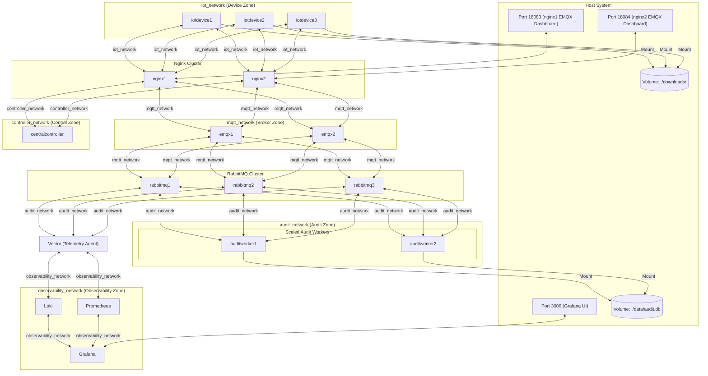

# Clustered EMQX, RabbitMQ, and .NET Observability System

This repository implements a multi-network, clustered MQTT telemetry and audit logging gateway using Docker Compose. The architecture demonstrates network segmentation, clustered message brokers, quorum queues, and unified observability (Loki, Prometheus, Grafana).

## Architecture Overview

The system runs entirely inside Docker/Podman across **5 isolated bridge networks** to simulate a secure production environment:

1. **`iot_network` (Device Zone)**: Contains the IoT Device simulators and Nginx reverse proxies. Isolated from all other networks.
2. **`mqtt_network` (Broker Zone)**: Contains Nginx, EMQX Cluster nodes, and RabbitMQ Cluster nodes.
3. **`controller_network` (Control Zone)**: Contains Nginx and the CentralController.
4. **`audit_network` (Audit/Backend Zone)**: Contains Audit Workers, RabbitMQ Cluster, and Vector.
5. **`observability_network` (Observability Zone)**: Contains Vector, Loki, Prometheus, and Grafana.



### Instance Scaling Layout
* **Nginx**: **2 instances** (`nginx1`, `nginx2`) sharing the `nginx` network alias for DNS round-robin load balancing.
* **EMQX**: **2 clustered core instances** (`emqx1`, `emqx2`).
* **RabbitMQ**: **3 clustered instances** (`rabbitmq1`, `rabbitmq2`, `rabbitmq3`) sharing the `rabbitmq` network alias for DNS round-robin.
* **CentralController**: **1 instance** (OTA server and EMQX bridge bootstrap worker).
* **IoTDevice**: **3 simulated instances** representing separate hardware devices (`device-1`, `device-2`, `device-3`).
* **AuditWorker**: **2 instances** (`auditworker1`, `auditworker2`) consuming audit messages and persisting to SQLite.

### Queue Configuration
* **`audit_queue`**: Configured as a **Quorum Queue** (`x-queue-type: quorum`) to ensure high availability and replication across the RabbitMQ cluster.
* **`vector_logs_queue`**, **`vector_metrics_queue`**, **`vector_telemetry_queue`**: Configured as **Classic Queues** (`x-queue-type: classic`).

---

## Getting Started

### Prerequisites
* Podman (or Docker) and Compose.

### Running the Stack
Launch the containers and clean up any retired or orphaned resources:
```bash
podman compose up -d --build --remove-orphans
```

---

## Verification Commands

### 1. Verify EMQX Clustering
Verify that the 2 EMQX nodes are clustered:
```bash
podman exec emqx1 emqx ctl cluster status
```

### 2. Verify RabbitMQ Clustering
Check that the 3 RabbitMQ nodes formed a healthy cluster:
```bash
podman exec rabbitmq1 rabbitmqctl cluster_status
```

### 3. Verify Queue Configurations
Check that the queue types are correctly configured (quorum vs classic):
```bash
curl -u guest:guest http://localhost:15672/api/queues
```

### 4. Check Persistent DB Writes (SQLite WAL Mode)
To inspect the SQLite database entries from the host while avoiding file locks, copy the database snapshot and query it with Python:
```powershell
# Copy the consistent snapshot from container
podman cp auditworker1:/app/data/audit.db ./copied_audit.db
podman cp auditworker1:/app/data/audit.db-wal ./copied_audit.db-wal
podman cp auditworker1:/app/data/audit.db-shm ./copied_audit.db-shm

# Run Python stats query
python -c "import sqlite3; conn = sqlite3.connect('copied_audit.db'); cur = conn.cursor(); cur.execute('SELECT COUNT(*), COUNT(DISTINCT WorkerName) FROM AuditLogs'); print('Stats:', cur.fetchone()); cur.execute('SELECT WorkerName, COUNT(*) FROM AuditLogs GROUP BY WorkerName'); print('Worker distribution:', cur.fetchall())"
```

### 5. Accessing Services on Host
* **EMQX Dashboards (Proxied)**:
  * Node 1 Dashboard: [http://localhost:18083](http://localhost:18083) (API Key: `adminkey:adminsecret`)
  * Node 2 Dashboard: [http://localhost:18084](http://localhost:18084)
* **RabbitMQ Management**: [http://localhost:15672](http://localhost:15672) (User/Pass: `guest` / `guest`)
* **Grafana Dashboard**: [http://localhost:3000](http://localhost:3000) (datasources Loki and Prometheus auto-provisioned)
* **Prometheus Targets**: [http://localhost:9090/targets](http://localhost:9090/targets)
