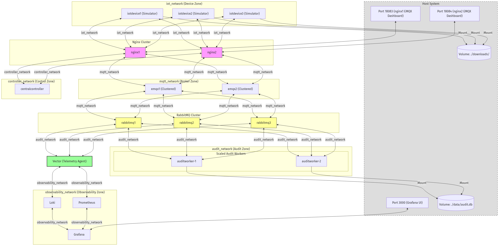
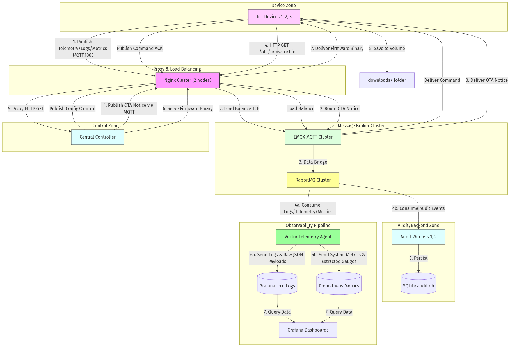
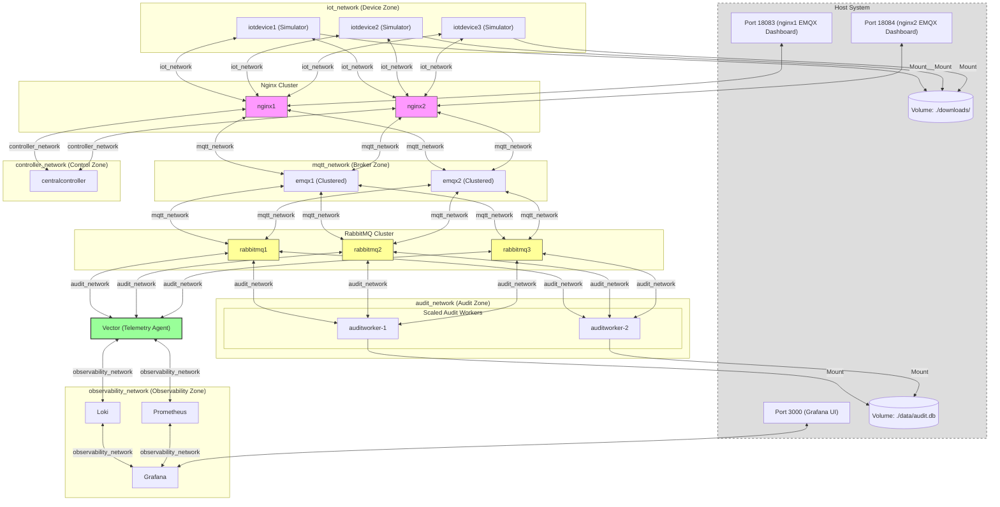
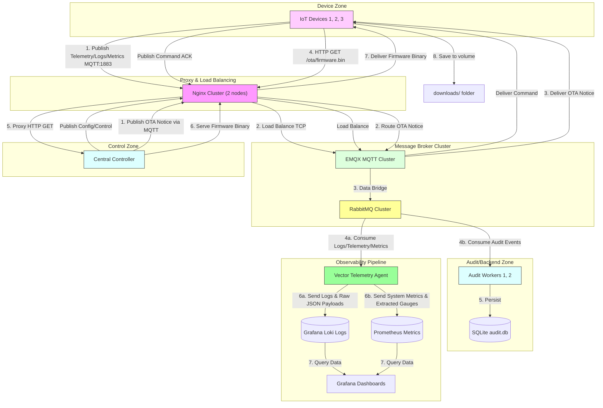

# Setup Observability: Clustered EMQX, RabbitMQ, Vector, Prometheus, Loki, Grafana, and .NET Services in Docker

This plan details the setup of three containerized .NET projects alongside a complete observability logging & telemetry gateway deployed entirely via Docker Compose:

1. **CentralController** (1 instance in Docker, exposing API and firmware hosting)
2. **IoTDevice** (3 scaled instances in Docker representing simulated IoT devices: `device-1`, `device-2`, and `device-3`)
3. **AuditWorker** (2 scaled instances in Docker, persisting audit trails concurrently to a SQLite database configured in WAL mode)
   > [!IMPORTANT]
   > **SQLite Concurrency & WAL Mode**: Since multiple AuditWorker instances write to a single shared SQLite database file (`audit.db`) concurrently via host volume mount, SQLite must be configured in Write-Ahead Logging (WAL) mode with a generous `busy_timeout` (e.g., 5000ms) to queue concurrent write requests and avoid lock conflicts.
4. **EMQX MQTT Cluster** (2 clustered nodes behind Nginx)
5. **RabbitMQ Broker Cluster** (3 clustered instances using a quorum queue for audit logs, classic queues for others)
6. **Vector, Loki, Prometheus, Grafana** (full observability telemetry pipelines)

All projects will be organized under a single .NET Solution (`MqttSystem.sln`) inside `d:\Repos\mqtt` and built locally using Dockerfiles.

### Proposed Architecture

With all components running in Docker, we implement strict network segmentation using five distinct Docker networks to simulate a secure, real-world production environment:

1. **`iot_network` (Device Zone)**: An isolated network containing the **IoT Devices** (simulators) and the **two Nginx** reverse proxies. The IoT Devices have no direct network access to any other containers.
2. **`mqtt_network` (Broker Zone)**: A private transit network containing the **two Nginx** load balancers, the **EMQX Cluster** nodes, and the **RabbitMQ Broker**. This limits broker-level communications to Nginx, EMQX, and RabbitMQ.
3. **`controller_network` (Control Zone)**: A private network containing the **two Nginx** instances and **CentralController**. This isolates controller-level HTTP firmware queries and MQTT traffic.
4. **`audit_network` (Audit/Backend Zone)**: A private network containing the **AuditWorker**, the **RabbitMQ Broker** (connected as a bridge), and **Vector** (acting as a bridge to pull data from RabbitMQ).
5. **`observability_network` (Observability Zone)**: A dedicated, isolated network containing **Vector**, **Loki**, **Prometheus**, and **Grafana**. This completely separates the monitoring stack from the application runtimes.

### Network Connectivity Rules:
- **Nginx as a Bridge**: The two Nginx instances (`nginx1` and `nginx2` sharing the DNS alias `nginx`) are connected to three networks (`iot_network`, `mqtt_network`, and `controller_network`), acting as the load-balanced gateway/bridge between the device zone, broker zone, and control zone.
- **Complete EMQX Isolation**: The EMQX MQTT cluster nodes run strictly inside `mqtt_network` and do **not** expose any ports (such as `1883` or `18083`) directly to the host machine or external networks. They only communicate with Nginx and RabbitMQ. All client connections must route through Nginx.
- **RabbitMQ as a Bridge**: The RabbitMQ Broker Cluster (3 instances: `rabbitmq1`, `rabbitmq2`, `rabbitmq3` with a shared DNS alias `rabbitmq`) is connected to both `mqtt_network` (to receive data bridges from EMQX nodes) and `audit_network` (to deliver messages to the Audit Worker and Vector pipelines).
- **Vector as an Observability Bridge**: The Vector Aggregator is connected to both `audit_network` (to consume logs/metrics/telemetry from RabbitMQ) and `observability_network` (to push data to Loki and Prometheus).
- **Observability Stack Isolation**: Loki, Prometheus, and Grafana are strictly inside `observability_network`. The only component interacting with them is Vector (sending data) and the user (accessing Grafana's exposed dashboard port `3000`).
- **MQTT Connectivity**: **IoT Devices** connect to Nginx at `nginx:1883` over `iot_network`. The **Central Controller** connects to Nginx at `nginx:1883` over `controller_network`. Nginx load balances this TCP traffic to the EMQX cluster over `mqtt_network`.
- **EMQX Dashboard / API**: Operators and developers access the EMQX Web Dashboard from the host machine via Nginx at `http://localhost:18083`. Nginx reverse proxies this traffic to the cluster over `mqtt_network`.
- **HTTP / OTA Connectivity**: **IoT Devices** download firmware updates via Nginx at `http://nginx:80/ota/...` (over `iot_network`), which Nginx reverse proxies to `centralcontroller:80/ota/...` (over `controller_network`).
- **Audit Worker**: Two scaled instances connect directly to RabbitMQ at `rabbitmq:5672` (resolving via round-robin DNS to `rabbitmq1`, `rabbitmq2`, or `rabbitmq3`) over `audit_network` as concurrent database writers.
- **Database & File Inspection**: Host volumes are mounted for the scaled `AuditWorker` instances (SQLite `audit.db`) and `IoTDevice` (`downloads/`) to allow direct inspection on the host machine.
- **Observability & Telemetry Pipeline (OTel Signals)**:
  - **`log`**: Application and container logs are consumed from RabbitMQ by Vector over `audit_network` and forwarded directly to **Loki** over `observability_network` for search and auditing.
  - **`metric`**: System performance metrics (CPU, RAM, network) are consumed from RabbitMQ by Vector over `audit_network` and exposed for **Prometheus** scraping over `observability_network`.
  - **`telemetry`**: Physical device sensor telemetry is consumed from RabbitMQ by Vector over `audit_network` and double-routed (Option A):
    - **Numeric values** (e.g., temperature, humidity) are extracted from the telemetry JSON payload and converted into Prometheus gauge metrics for historical trends and alerting over `observability_network`.
    - **Raw JSON payloads** are forwarded to Loki over `observability_network` as structured telemetry events to maintain a complete history of the raw device messages.
    - **Grafana**: Serves as the single dashboard interface, querying data from both Loki and Prometheus over `observability_network` to visualize logs, metrics, and telemetry side-by-side.

### Visual Architecture Diagram



### Logical Message Flow Diagram



<details>
<summary>Show Mermaid Diagram Sources</summary>

#### System Architecture Diagram Source


#### Logical Message Flow Diagram Source

</details>

---

## MQTT Topic Design

Following the format: `ProjectPrefix/Organization/DeviceID/FeatureCategory/Direction`:

- The `{DeviceId}` token matches the `DEVICE_ID` environment variable passed into each container (`device-1`, `device-2`, `device-3`).

### 1. Status & Survival — QoS 1

- **Topic**: `mqttsystem/org1/{DeviceId}/status/up` (QoS 1, Retained, Birth & LWT)

### 2. Real-Time Data (实时Log/Telemetry/Metric) — QoS 0

- **Logs / Telemetry / Metrics**: topics as designed previously.

### 3. Hardware Peripherals (硬件外设状态) — QoS 1

- **Topic**: `mqttsystem/org1/{DeviceId}/peripheral/up` (QoS 1)

### 4. Audit Logs (审计日志) — QoS 1

- **Topic**: `mqttsystem/org1/{DeviceId}/audit/up` (QoS 1)

### 5. Configuration Distribution — QoS 1 with TraceId

- **Topics**: `mqttsystem/org1/{DeviceId}/config/down` and `mqttsystem/org1/{DeviceId}/config/up`

### 6. OTA Firmware Upgrade — QoS 1 with TraceId

- **Topics**: `mqttsystem/org1/{DeviceId}/ota/down` and `mqttsystem/org1/{DeviceId}/ota/up`

### 7. Remote Control Commands — QoS 1 with TraceId

- **Topics**: `mqttsystem/org1/{DeviceId}/control/down` and `mqttsystem/org1/{DeviceId}/control/up`

---

## Proposed Changes

### Project Structure

```
d:\Repos\mqtt\
├── MqttSystem.sln
├── docker-compose.yml
├── nginx/
│   └── nginx.conf
├── rabbitmq/
│   ├── enabled_plugins
│   ├── rabbitmq.conf
│   └── definitions.json
├── vector/
│   └── vector.toml
├── prometheus/
│   └── prometheus.yml
├── grafana/
│   └── provisioning/
│       └── datasources/
│           └── datasources.yml
└── src/
    ├── CentralController/
    │   ├── CentralController.csproj
    │   ├── Program.cs
    │   ├── Dockerfile
    │   └── wwwroot/
    │       └── ota/
    │           └── firmware-v1.2.0.bin
    ├── IoTDevice/
    │   ├── IoTDevice.csproj
    │   ├── Program.cs
    │   └── Dockerfile
    └── AuditWorker/
        ├── AuditWorker.csproj
        ├── Program.cs
        ├── AuditContext.cs
        ├── AuditLogWorker.cs
        └── Dockerfile
```

### 1. Dockerfiles for .NET Services

- Define multi-stage build configurations for compiling and packaging the three applications in release mode.

### 2. Docker Compose Configuration

#### [MODIFY] [docker-compose.yml](file:///d:/Repos/mqtt/docker-compose.yml)

- Define five bridge networks: `iot_network`, `mqtt_network`, `controller_network`, `audit_network`, and `observability_network`.
- Configure `iotdevice1/2/3` to belong strictly to `iot_network`.
- Configure `emqx1/2` to belong strictly to `mqtt_network`.
- Configure centralcontroller to belong strictly to controller_network.
- Configure two scaled instances of `auditworker` to belong strictly to `audit_network`.
- Configure three clustered instances of RabbitMQ (`rabbitmq1`, `rabbitmq2`, `rabbitmq3`) with classic peer discovery and a shared Erlang cookie. They belong to **both** `mqtt_network` (for EMQX) and `audit_network` (for Audit Worker and Vector) under a shared network alias `rabbitmq` to enable round-robin DNS.
- Configure vector to belong to **both** `audit_network` (for RabbitMQ) and `observability_network` (for Loki and Prometheus).
- Configure loki, prometheus, and grafana to belong strictly to `observability_network`.
- Configure two instances of Nginx (`nginx1`, `nginx2`) to belong to `iot_network`, `mqtt_network`, and `controller_network` under the shared network alias `nginx`.
- Map local volume mounts for the `auditworker` SQLite database (shared via SQLite WAL configuration on host) and the download output directories for the IoT devices.

### 3. Central Controller & IoT Device Simulator Implementations

- Dynamic connection configurations using service names on the bridge network and env loading.

### 4. Nginx Reverse Proxy Configuration

#### [NEW] [nginx.conf](file:///d:/Repos/mqtt/nginx/nginx.conf)

- Configure the Nginx TCP load balancer (`stream` context) to proxy and load balance port `1883` to the 3 EMQX backend container nodes.
- Configure the Nginx HTTP server to proxy port `80` requests (`/ota/...`) to the `centralcontroller` container.
- Configure the Nginx HTTP server to proxy port `18083` to the EMQX dashboard backend nodes, making the dashboard only accessible externally through Nginx.
- Ensure the `docker-compose.yml` does **not** map EMQX container ports (`1883`, `18083`, `8083`, etc.) to the host, keeping EMQX fully private and hidden behind Nginx.

---

## Verification Plan

### Automated Tests

- Verify compilation: `dotnet build MqttSystem.sln`

### Manual Verification

1. Start entire stack: `docker compose up -d --build`.
2. Inspect log outputs and query data records.
